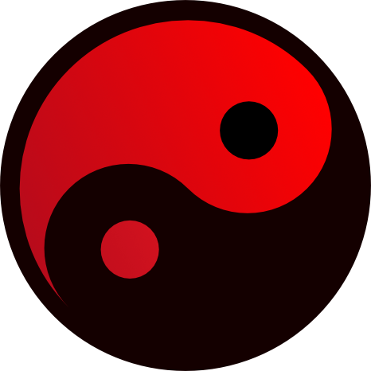
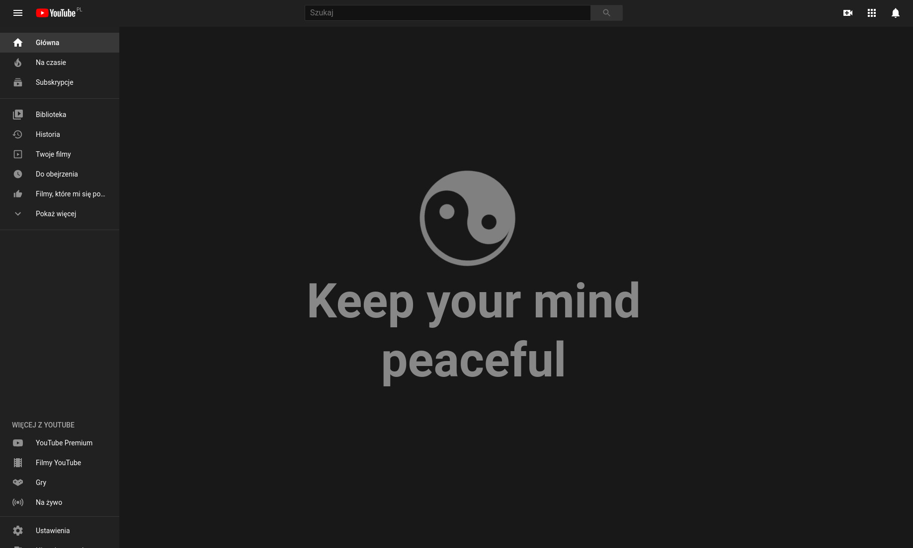

    

# Zen Mode

YouTube Zen-Mode Extension for **Safari**, **FireFox** and **Chromium** (Chrome, Brave, Opera, Edge)

    
    

### What it does?

Zen mode extension removes distractions from YouTube. It hides the popular videos and the news feed in the home tab, comments under videos and makes binge watching harder by desaturating colors from the suggested videos on the right pane.

### Safari support

Zen mode now supports Safari. You can download the addon in [Releases Page](https://github.com/Ph0enixKM/YouTube-Zen-Mode/releases)

